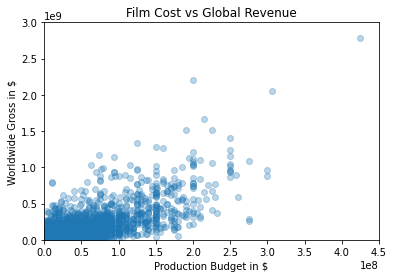

```python
import pandas
from pandas import DataFrame
import matplotlib.pyplot as plt
```


```python
data = pandas.read_csv('cost_revenue_clean.csv')
```


```python
data.describe()
```


<div>
<style scoped>
    .dataframe tbody tr th:only-of-type {
        vertical-align: middle;
    }

    .dataframe tbody tr th {
        vertical-align: top;
    }

    .dataframe thead th {
        text-align: right;
    }
</style>
<table border="1" class="dataframe">
  <thead>
    <tr style="text-align: right;">
      <th></th>
      <th>production_budget_usd</th>
      <th>worldwide_gross_usd</th>
    </tr>
  </thead>
  <tbody>
    <tr>
      <th>count</th>
      <td>5.034000e+03</td>
      <td>5.034000e+03</td>
    </tr>
    <tr>
      <th>mean</th>
      <td>3.290784e+07</td>
      <td>9.515685e+07</td>
    </tr>
    <tr>
      <th>std</th>
      <td>4.112589e+07</td>
      <td>1.726012e+08</td>
    </tr>
    <tr>
      <th>min</th>
      <td>1.100000e+03</td>
      <td>2.600000e+01</td>
    </tr>
    <tr>
      <th>25%</th>
      <td>6.000000e+06</td>
      <td>7.000000e+06</td>
    </tr>
    <tr>
      <th>50%</th>
      <td>1.900000e+07</td>
      <td>3.296202e+07</td>
    </tr>
    <tr>
      <th>75%</th>
      <td>4.200000e+07</td>
      <td>1.034471e+08</td>
    </tr>
    <tr>
      <th>max</th>
      <td>4.250000e+08</td>
      <td>2.783919e+09</td>
    </tr>
  </tbody>
</table>
</div>


```python
X = DataFrame(data,columns=['production_budget_usd'])
y = DataFrame(data,columns=['worldwide_gross_usd'])
```


```python
plt.scatter(X,y, alpha=0.3)
plt.title("Film Cost vs Global Revenue")
plt.xlabel("Production Budget in $")
plt.ylabel("Worldwide Gross in $")
plt.ylim(0,3000000000)
plt.xlim(0,450000000)

plt.show()

```





```python

```
